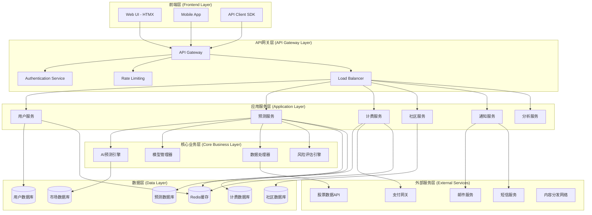
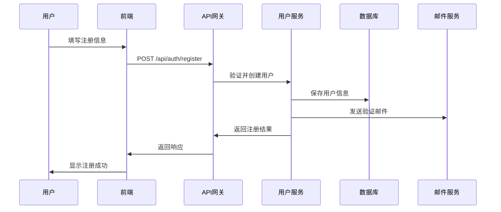
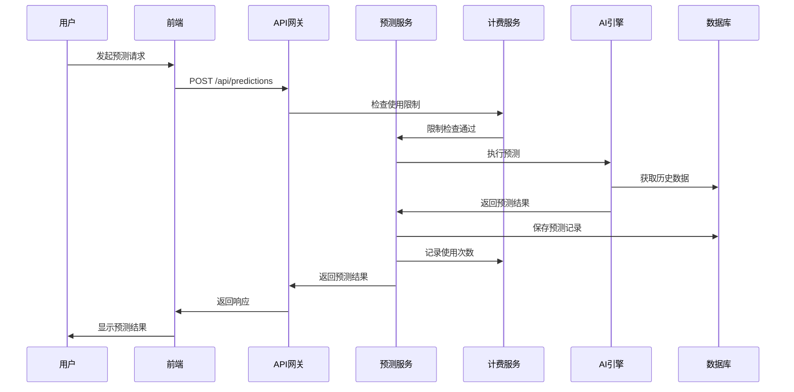
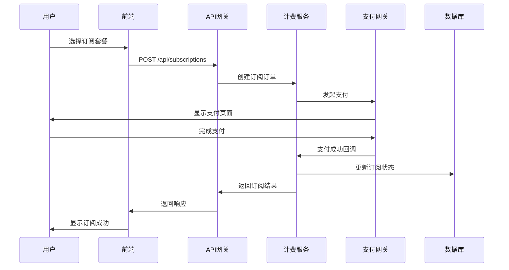

# Kronos 智能投资平台 - 系统架构设计

## 🏗️ 总体架构概览



## 📊 详细架构分层设计

### 1. 前端层 (Frontend Layer)

#### 1.1 Web应用架构
```
app/
├── static/
│   ├── css/
│   │   ├── layout.css          # 基础布局样式
│   │   ├── modern.css          # 现代化组件样式
│   │   ├── components.css      # 通用组件样式
│   │   └── themes/             # 主题样式
│   ├── js/
│   │   ├── layout.js           # 布局管理器
│   │   ├── components.js       # 组件控制器
│   │   ├── prediction.js       # 预测功能逻辑
│   │   ├── community.js        # 社区交互逻辑
│   │   └── utils.js            # 工具函数
│   └── assets/
│       ├── images/             # 图片资源
│       └── icons/              # 图标资源
├── templates/
│   ├── layout.html             # 基础模板
│   ├── pages/                  # 页面模板
│   │   ├── index.html          # 首页
│   │   ├── dashboard.html      # 仪表盘
│   │   ├── prediction.html     # 预测页面
│   │   ├── community.html      # 社区页面
│   │   └── profile.html        # 用户中心
│   └── components/             # 组件模板
│       ├── prediction_card.html
│       ├── user_menu.html
│       ├── market_overview.html
│       └── ai_insights.html
```

#### 1.2 前端技术栈
- **HTMX**: 服务端驱动的动态交互
- **CSS Grid/Flexbox**: 响应式布局系统
- **Plotly.js**: 专业数据可视化
- **Font Awesome**: 图标系统
- **Progressive Web App**: 渐进式Web应用

### 2. API网关层 (API Gateway Layer)

#### 2.1 API网关职责
```python
# API Gateway 配置示例
class APIGatewayConfig:
    RATE_LIMITS = {
        'free_user': {'predictions': 3, 'api_calls': 10},
        'basic_user': {'predictions': 50, 'api_calls': 100},
        'pro_user': {'predictions': 500, 'api_calls': 1000},
        'enterprise_user': {'predictions': -1, 'api_calls': 10000}
    }
    
    AUTHENTICATION = {
        'jwt_secret': 'your-secret-key',
        'token_expiry': 24 * 60 * 60,  # 24 hours
        'refresh_token_expiry': 30 * 24 * 60 * 60  # 30 days
    }
    
    CORS_SETTINGS = {
        'allowed_origins': ['https://kronos.app', 'https://app.kronos.com'],
        'allowed_methods': ['GET', 'POST', 'PUT', 'DELETE'],
        'allowed_headers': ['Content-Type', 'Authorization']
    }
```

#### 2.2 认证与授权
```python
# JWT Token结构
class TokenPayload:
    user_id: str
    email: str
    subscription_tier: str  # free, basic, pro, enterprise
    permissions: List[str]
    issued_at: datetime
    expires_at: datetime
```

### 3. 应用服务层 (Application Layer)

#### 3.1 用户服务 (User Service)
```python
class UserService:
    def register_user(self, email, password, phone=None):
        """用户注册"""
        pass
    
    def authenticate_user(self, email, password):
        """用户认证"""
        pass
    
    def get_user_profile(self, user_id):
        """获取用户资料"""
        pass
    
    def update_subscription(self, user_id, plan):
        """更新订阅计划"""
        pass
    
    def get_usage_stats(self, user_id):
        """获取使用统计"""
        pass
```

#### 3.2 预测服务 (Prediction Service)
```python
class PredictionService:
    def create_prediction(self, user_id, stock_symbol, model_type, days):
        """创建预测"""
        pass
    
    def get_prediction_history(self, user_id, limit=20):
        """获取预测历史"""
        pass
    
    def get_prediction_accuracy(self, user_id):
        """获取预测准确率"""
        pass
    
    def compare_models(self, stock_symbol, days):
        """模型对比"""
        pass
```

#### 3.3 计费服务 (Billing Service)
```python
class BillingService:
    def check_usage_limit(self, user_id, action_type):
        """检查使用限制"""
        pass
    
    def record_usage(self, user_id, action_type):
        """记录使用"""
        pass
    
    def create_subscription(self, user_id, plan):
        """创建订阅"""
        pass
    
    def process_payment(self, user_id, amount, payment_method):
        """处理支付"""
        pass
```

#### 3.4 社区服务 (Community Service)
```python
class CommunityService:
    def create_post(self, user_id, content, prediction_id=None):
        """创建帖子"""
        pass
    
    def get_community_feed(self, user_id, page=1):
        """获取社区动态"""
        pass
    
    def like_post(self, user_id, post_id):
        """点赞帖子"""
        pass
    
    def add_comment(self, user_id, post_id, content):
        """添加评论"""
        pass
```

### 4. 核心业务层 (Core Business Layer)

#### 4.1 AI预测引擎
```python
class AIEngine:
    def __init__(self):
        self.models = {
            'kronos-base': BaseModel(),
            'kronos-mini': MiniModel(), 
            'kronos-small': SmallModel()
        }
    
    def predict(self, stock_symbol, days, model_type='kronos-base'):
        """执行预测"""
        model = self.models[model_type]
        data = self.prepare_data(stock_symbol)
        prediction = model.predict(data, days)
        confidence = model.calculate_confidence(prediction)
        return {
            'prediction': prediction,
            'confidence': confidence,
            'model_used': model_type,
            'timestamp': datetime.now()
        }
    
    def prepare_data(self, stock_symbol):
        """准备训练数据"""
        pass
```

#### 4.2 模型管理器
```python
class ModelManager:
    def load_model(self, model_name):
        """加载模型"""
        pass
    
    def update_model(self, model_name, model_path):
        """更新模型"""
        pass
    
    def get_model_performance(self, model_name):
        """获取模型性能指标"""
        pass
    
    def compare_model_performance(self):
        """对比模型性能"""
        pass
```

### 5. 数据层 (Data Layer)

#### 5.1 数据库设计

##### 用户数据库 (User Database)
```sql
-- 用户表
CREATE TABLE users (
    id UUID PRIMARY KEY,
    email VARCHAR(255) UNIQUE NOT NULL,
    phone VARCHAR(20),
    password_hash VARCHAR(255) NOT NULL,
    subscription_tier VARCHAR(20) DEFAULT 'free',
    created_at TIMESTAMP DEFAULT CURRENT_TIMESTAMP,
    updated_at TIMESTAMP DEFAULT CURRENT_TIMESTAMP
);

-- 用户配置表
CREATE TABLE user_profiles (
    user_id UUID REFERENCES users(id),
    display_name VARCHAR(100),
    avatar_url VARCHAR(500),
    risk_tolerance VARCHAR(20) DEFAULT 'medium',
    investment_experience VARCHAR(20) DEFAULT 'beginner',
    preferred_sectors TEXT[],
    notification_preferences JSONB
);

-- 订阅表
CREATE TABLE subscriptions (
    id UUID PRIMARY KEY,
    user_id UUID REFERENCES users(id),
    plan VARCHAR(20) NOT NULL,
    status VARCHAR(20) DEFAULT 'active',
    start_date TIMESTAMP NOT NULL,
    end_date TIMESTAMP,
    payment_method VARCHAR(50),
    amount DECIMAL(10,2)
);
```

##### 预测数据库 (Prediction Database)
```sql
-- 预测记录表
CREATE TABLE predictions (
    id UUID PRIMARY KEY,
    user_id UUID REFERENCES users(id),
    stock_symbol VARCHAR(10) NOT NULL,
    model_type VARCHAR(20) NOT NULL,
    prediction_days INTEGER NOT NULL,
    current_price DECIMAL(10,2) NOT NULL,
    predicted_price DECIMAL(10,2) NOT NULL,
    confidence DECIMAL(5,2) NOT NULL,
    prediction_data JSONB,
    created_at TIMESTAMP DEFAULT CURRENT_TIMESTAMP
);

-- 预测结果验证表
CREATE TABLE prediction_results (
    prediction_id UUID REFERENCES predictions(id),
    actual_price DECIMAL(10,2),
    accuracy_score DECIMAL(5,2),
    verified_at TIMESTAMP,
    status VARCHAR(20) DEFAULT 'pending'
);

-- 股票数据表
CREATE TABLE stock_data (
    symbol VARCHAR(10),
    date DATE,
    open_price DECIMAL(10,2),
    close_price DECIMAL(10,2),
    high_price DECIMAL(10,2),
    low_price DECIMAL(10,2),
    volume BIGINT,
    PRIMARY KEY (symbol, date)
);
```

##### 社区数据库 (Community Database)
```sql
-- 帖子表
CREATE TABLE posts (
    id UUID PRIMARY KEY,
    user_id UUID REFERENCES users(id),
    title VARCHAR(200),
    content TEXT NOT NULL,
    prediction_id UUID REFERENCES predictions(id),
    likes_count INTEGER DEFAULT 0,
    comments_count INTEGER DEFAULT 0,
    created_at TIMESTAMP DEFAULT CURRENT_TIMESTAMP
);

-- 评论表
CREATE TABLE comments (
    id UUID PRIMARY KEY,
    post_id UUID REFERENCES posts(id),
    user_id UUID REFERENCES users(id),
    content TEXT NOT NULL,
    parent_comment_id UUID REFERENCES comments(id),
    created_at TIMESTAMP DEFAULT CURRENT_TIMESTAMP
);

-- 点赞表
CREATE TABLE likes (
    user_id UUID REFERENCES users(id),
    post_id UUID REFERENCES posts(id),
    created_at TIMESTAMP DEFAULT CURRENT_TIMESTAMP,
    PRIMARY KEY (user_id, post_id)
);
```

#### 5.2 缓存策略
```python
class CacheStrategy:
    # Redis缓存配置
    CACHE_CONFIGS = {
        'user_sessions': {'ttl': 24 * 60 * 60},  # 24小时
        'stock_data': {'ttl': 5 * 60},           # 5分钟
        'predictions': {'ttl': 60 * 60},         # 1小时
        'market_overview': {'ttl': 30},          # 30秒
        'user_limits': {'ttl': 60 * 60}          # 1小时
    }
```

### 6. 外部服务集成

#### 6.1 股票数据源
```python
class StockDataProvider:
    def __init__(self):
        self.providers = {
            'primary': TushareAPI(),
            'backup': AkshareAPI(),
            'realtime': SinaFinanceAPI()
        }
    
    def get_stock_data(self, symbol, start_date, end_date):
        """获取股票历史数据"""
        pass
    
    def get_realtime_price(self, symbol):
        """获取实时价格"""
        pass
```

#### 6.2 支付系统集成
```python
class PaymentGateway:
    def __init__(self):
        self.providers = {
            'alipay': AlipayGateway(),
            'wechat': WechatPayGateway(),
            'stripe': StripeGateway()
        }
    
    def process_payment(self, amount, method, user_info):
        """处理支付"""
        pass
    
    def create_subscription(self, plan, user_id):
        """创建订阅"""
        pass
```

## 🔄 核心业务流程

### 1. 用户注册流程


### 2. 预测生成流程


### 3. 订阅升级流程


## 🛡️ 安全架构

### 1. 认证安全
- JWT Token认证
- 双因子认证 (2FA)
- 密码强度验证
- 登录异常检测

### 2. 数据安全
- 数据库加密
- API加密传输 (HTTPS)
- 敏感数据脱敏
- 数据备份策略

### 3. 业务安全
- 接口防刷机制
- 用户行为监控
- 异常交易检测
- 风控规则引擎

## 📈 性能优化策略

### 1. 前端优化
- 静态资源CDN加速
- 图片懒加载
- 代码分割与按需加载
- 服务端渲染 (SSR)

### 2. 后端优化
- 数据库连接池
- Redis缓存策略
- 异步任务处理
- 微服务架构

### 3. 数据库优化
- 索引优化
- 分库分表
- 读写分离
- 数据归档策略

## 🔄 部署架构

### 1. 容器化部署
```yaml
# docker-compose.yml
version: '3.8'
services:
  app:
    build: .
    ports:
      - "5000:5000"
    environment:
      - FLASK_ENV=production
    depends_on:
      - postgres
      - redis
  
  postgres:
    image: postgres:13
    environment:
      POSTGRES_DB: kronos
      POSTGRES_USER: kronos
      POSTGRES_PASSWORD: ${DB_PASSWORD}
    volumes:
      - postgres_data:/var/lib/postgresql/data
  
  redis:
    image: redis:6-alpine
    volumes:
      - redis_data:/data
  
  nginx:
    image: nginx:alpine
    ports:
      - "80:80"
      - "443:443"
    volumes:
      - ./nginx.conf:/etc/nginx/nginx.conf
    depends_on:
      - app
```

### 2. 监控与日志
- 应用性能监控 (APM)
- 错误追踪与报警
- 业务指标监控
- 日志聚合与分析

这个架构设计为Kronos平台提供了完整的技术蓝图，确保系统的可扩展性、可靠性和安全性，为后续的功能实现提供了清晰的技术指导。