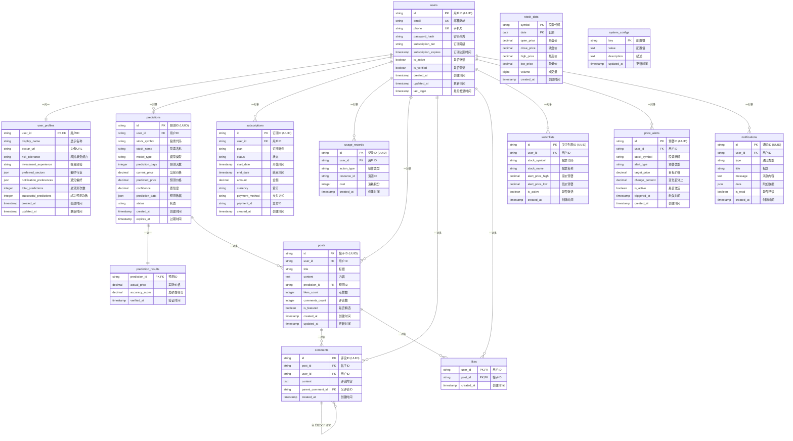

# Kronos Stock 数据库设计

## 数据库关系图

## 数据库表说明

### 核心业务表

#### 1. 用户管理
- **users**: 用户基础信息表，存储登录凭证和订阅信息
- **user_profiles**: 用户详细配置表，存储个人偏好和统计数据

#### 2. 预测业务
- **predictions**: 股票预测记录表，核心业务表
- **prediction_results**: 预测结果验证表，用于评估预测准确性
- **stock_data**: 股票历史数据表，支持预测算法

#### 3. 订阅计费
- **subscriptions**: 用户订阅记录表
- **usage_records**: 用户使用记录表，用于计费和限额控制

#### 4. 社区功能
- **posts**: 社区帖子表，用户可分享预测见解
- **comments**: 评论表，支持嵌套评论
- **likes**: 点赞表，用户互动功能

#### 5. 个性化服务
- **watchlists**: 用户关注股票列表
- **price_alerts**: 价格预警设置
- **notifications**: 系统通知表

#### 6. 系统管理
- **system_configs**: 系统配置表，存储应用级配置参数

## 主要特性

### 数据完整性保证
- 使用 UUID 作为主键，避免 ID 冲突
- 外键约束确保数据一致性
- 级联删除保证数据清理完整性

### 性能优化
- 针对常用查询创建复合索引
- 分离冷热数据（历史数据 vs 活跃数据）
- JSON 字段存储灵活配置数据

### 扩展性设计
- 预测数据使用 JSON 存储，支持不同模型格式
- 通知系统支持多种类型扩展
- 配置表支持动态系统参数调整

### 业务逻辑支持
- 订阅等级控制使用限额
- 预测结果自动过期机制
- 社区内容与预测记录关联
- 灵活的价格预警机制

## 索引策略

关键查询路径的索引优化：
- 用户邮箱唯一索引（登录查询）
- 预测记录按用户和时间的复合索引
- 股票数据按代码和日期的复合索引
- 通知按用户和读取状态的复合索引

## 数据保留策略

- 股票历史数据保留 365 天
- 系统通知保留 30 天
- 预测记录永久保留（用于模型训练）
- 用户行为记录用于分析和计费